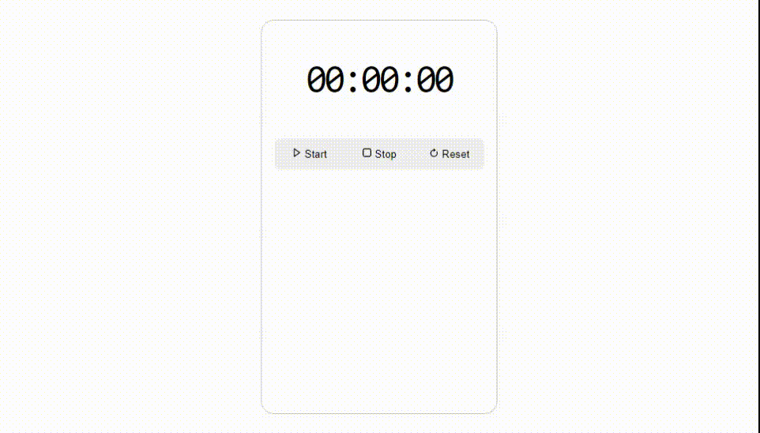
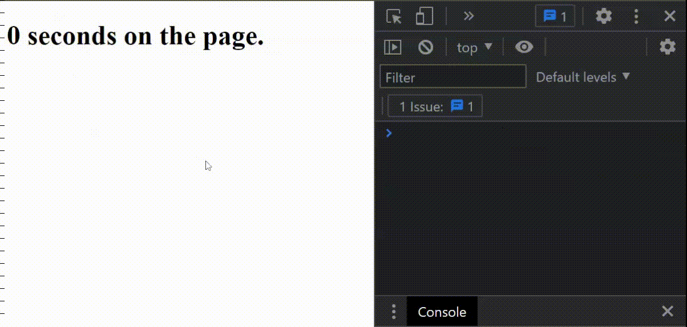

# react-classcomponent
## Stopwatch ⏰ with time lapse ❤️

Hey folks 🤓 this is my cool ⏱️ stopwatch project in ✨ React.js with time lapse feature.

View the project [here](https://codepen.io/umairzxy/full/PoONwgo) on **Codepen** 💜

## Project setup 💡

🔗 This project is created using [Create React App](https://create-react-app.dev/), an integrated toolchain for the best user and developer experience.

To view the project — clone the repo and type commands in the console:
```
cd react-classcomponent
npm install
npm start
```
This will open a development server on **localhost:3000** 🚀 — react also uses module bundler as **Webpack!**

> A module bundler is a tool that takes pieces of JavaScript and their dependencies and bundles them into a single file, usually for use in the browser.



## React.js State 😱
> A state is an object which 🎯 triggers the change in component when the state is changed — that's why the term **React** means it reacts to the state.

For example, let's create a tracker to track total time by user stays on the page — just like the **functional** component, you can also define `class` based components.
```js
class Tracker extends React.Component {
    render() {
        return (
            <h1>0 seconds on the page.</h1>
        )
    }
}
```
In class-based components, if you pass `props` to component so you're required to call the `super()` within the `constructor()` function, as documented [here](https://reactjs.org/docs/state-and-lifecycle.html).
```js
class Tracker extends React.Component {
    constructor(props) {
        super(props)
    }
    render() {
        return (
            <h1>0 seconds on the page.</h1>
        )
    }
}
```
To set the state of the component, initialize the `state` object within the `constructor()`
```js
constructor(props) {
    super(props)
    this.state = { seconds: 0 }
}
```
Now, add an `update()` method in the class component.
```js
update() {
    this.setState({
        seconds: this.state.seconds + 1
    })
}
```
You're almost done, you just need to 📞 call the `update()` method to increment the total seconds as soon as the user visits the page.

## React.js Lifecycle methods 🚩

> Lifecycle methods are just like 👶 birth, 👦 growth and 💀 death of the the component, some additional phases like `mount`, `update` and `unmount`.

The `componentDidMount()` method runs after the component output has been rendered to 💜 the DOM. This is a good place to set up a timer.
```js
class Tracker extends React.Component {
    constructor(props) {
        super(props)
        this.state = { seconds: 0 }
    }
    update() {
        this.setState({
            seconds: this.state.seconds + 1
        })
        console.log("I'm alive 💀")
    }
    componentDidMount() {
        this.timer = setInterval(() => this.update(), 1000)
    }
    render() {
        return (
            <h1>0 seconds on the page.</h1>
        )
    }
}
```
Now, in the `render()` method you can insert any valid JavaScript expression within `{ }` curly brackets.
```js
render() {
    return (
        <h1>{this.state.seconds} seconds on the page.</h1>
    )
}
```
At this point, your code is working as 👍 expected, but what if you accidentally remove the component? 🤔
```js
document.getElementById('root').remove()
```


For best practice 🤓 always clear all `timouts` before component will unmount.
```js
componentWillUnmount() {
    clearInterval(this.timer);
}
```

## Congratulations! 🥳🎉
You have created your first class component using React.js

🔗 But there's more you can read on https://reactjs.org/docs/react-component.html